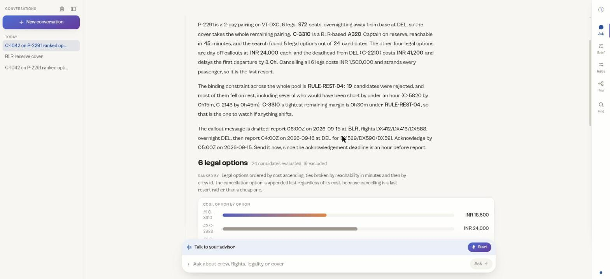
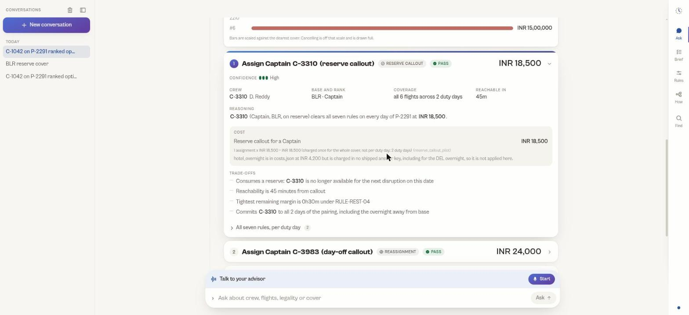

<p align="center">
  <a href="https://extroc-jpkcqxtlma-uc.a.run.app">
    
  </a>
</p>

<p align="center"><b>A crew desk advisor that never guesses.</b></p>

<p align="center">
  The model plans and explains. Deterministic code computes.<br>
  A guard checks every figure in the answer against what the tools returned.
</p>

<p align="center">
  <a href="https://extroc-jpkcqxtlma-uc.a.run.app"></a>
  <a href="#quick-start"></a>
  <a href="docs/architecture.pdf"></a>
  <a href="docs/DECK.md"></a>
  
  
  
</p>

<p align="center">
  <a href="https://extroc-jpkcqxtlma-uc.a.run.app"><b>Open the live demo</b></a> &nbsp;&middot;&nbsp;
  <a href="docs/SETUP.md">Setup</a> &nbsp;&middot;&nbsp;
  <a href="docs/AGENT-DESIGN.md">Agent design</a> &nbsp;&middot;&nbsp;
  <a href="docs/FAILURE-ANALYSIS.md">What breaks</a> &nbsp;&middot;&nbsp;
  <a href="docs/VOICE.md">Voice</a> &nbsp;&middot;&nbsp;
  <a href="COMMANDS.md">Demo script</a>
</p>

<p align="center">
  <a href="https://extroc-jpkcqxtlma-uc.a.run.app/ask">
    
  </a>
</p>

---

A controller asks a question in plain language. The system answers with a
figure, the arithmetic behind it, the rules it checked, and the options it
ranked. When it cannot answer reliably it says so, and says what was missing.

Built for the dCortex "Agentic Crew Ops Advisor" hackathon.

## Quick start

Needs Python 3.12 or 3.13, Node 20+, [uv](https://docs.astral.sh/uv/) and
[pnpm](https://pnpm.io/).

```bash
make install     # Python env via uv, web deps via pnpm
make dev         # API on :8000, web on :3000
```

Open <http://localhost:3000>. The console is at `/ask`.

**No API key is needed.** Without one the deterministic resolver answers,
through the same tools, the same rules engine and the same grounding check.
Setting `ANTHROPIC_API_KEY`, `OPENAI_API_KEY` or `OLLAMA_API_KEY` turns on the
LangGraph agent, which adds planning and language, not truth.

```bash
make check       # ruff, mypy, the boundary test, the full suite
make eval        # scorecard across all 38 questions, every tier
cd api && uv run crewops ask "Who is on reserve at BLR on 2026-09-15?"
```

Running the halves separately, every environment variable, what each route is,
and what to do when it does not work: [`docs/SETUP.md`](docs/SETUP.md).

---

## The one design decision

The problem statement asks one question directly:

> What should the language model do, what should deterministic code do, and how
> do you compose them into a system that is both conversational and correct?

Our answer:

**The language model plans and explains. It never produces a fact and never
does arithmetic.**

A LangGraph agent decides which computations to run, in what order, and how to
phrase the result for someone under time pressure. Deterministic Python does
the computing. A verifier then checks every number, identifier, date, station
code and rule id in the drafted reply against what the tools actually returned,
and rejects anything unattested.

That boundary is not a convention we tried to follow. It is enforced three ways:

| Mechanism | What it stops |
|---|---|
| `api/tests/test_boundary.py` walks the import graph of `domain`, `rules`, `ops`, `store`, `tools` and `verify` and fails the build if a model client is reachable | Arithmetic drifting into the model's half |
| The verifier rejects any atom in the prose that no tool emitted as a `Fact` this turn | The model stating a plausible number nobody computed |
| Graph edges, not prompt text, require a `check_legality` result before any legality claim and a `find_cover_options` result before any recommendation | The model inferring a verdict from context |

The third one matters most. A guarantee written into a prompt is a request. A
guarantee written as a graph edge is a guarantee.

---

## Architecture

```
Next.js console  --SSE-->  FastAPI  -->  LangGraph agent
                                             |
                          +------------------+------------------+
                          |                  |                  |
                       planner             tools             verifier
                        (LLM)          (deterministic)    (deterministic)
                                             |
                                    +--------+--------+
                                rules engine     ops engine
                               (the 7 rules)   (cover search,
                                               costing, ranking)
                                             |
                                        WorldState
                                 (typed, immutable, loaded once)
                                             |
                                      SQLite projection
```

The interactive version, including which side of the line each component sits
on, is at `/architecture` in the running app and as
[`docs/architecture.pdf`](docs/architecture.pdf).

### What each layer may do

| Path | Responsibility | Model allowed |
|---|---|---|
| `api/src/crewops/contracts/` | Shared types. The seam three workstreams built against. | no |
| `api/src/crewops/domain/` | Typed records, loader, immutable `WorldState`, copy-on-write overlay | no |
| `api/src/crewops/rules/` | Clock arithmetic, the seven rules, `RuleTrace` | never |
| `api/src/crewops/ops/` | Cover search, positioning, costing, ranking, simulation | never |
| `api/src/crewops/store/` | SQLite projection and typed queries | no |
| `api/src/crewops/tools/` | The tool surface the agent calls | no |
| `api/src/crewops/agent/` | LangGraph graph, prompts, memory, guards | yes, this is the agent |
| `api/src/crewops/agent/voice/` | Speech in and out. Selects prose, never writes it. | no |
| `api/src/crewops/verify/` | The grounding verifier | no |
| `api/src/crewops/resolve/` | Offline resolver, used when no API key is set | no |
| `api/src/crewops/server/` | FastAPI, SSE streaming | no |
| `web/` | Next.js console. No answering logic, ever. | no |

---

## Evidence, and why every number carries its working

Every tool returns a `ToolEnvelope`. Inside it, every figure is a `Fact`:

```python
Fact(
    key="C-2087.duty_7d.projected",
    label="Projected 7 day duty",
    value=61.33,
    unit="hours",
    provenance=Provenance.COMPUTED,
    source="crewops.rules.duty.window",
    derivation="51.83h prior + 9.50h from P-2291 = 61.33h against a 60.00h limit, over by 1.33h",
)
```

`derivation` is the point. A controller who is about to move a crew member and
sign their name to it does not want to be told the answer, they want to be able
to check it and argue with it. In the console, hovering any figure in the prose
opens the fact that attests it and shows this derivation.

It is also what makes the verifier possible. If a number can appear in an
answer, a tool must have emitted a `Fact` for it. When verification fails, the
fix is to add the missing fact to the tool. It is never to relax the check.

<p align="center">
  
</p>

---

## Voice is a peripheral, not a second brain

Speech in becomes a transcript, the transcript goes to the same `/api/chat`,
and the answer comes back through the same tools, the same seven rules and the
same grounding verifier. Speech out reads prose the verifier already passed:
`agent/voice/prose.py` selects and chunks the existing headline, body and
caveats, and returns nothing at all when verification is not `verified` or
`repaired`, so a rejected draft is never spoken.

Nothing under `agent/voice/` imports a model client. No speech provider ever
sees the dataset, and none of them can put a figure on screen. Setup and
controls: [`docs/VOICE.md`](docs/VOICE.md).

---

## The dataset is read only

`data/` is the provided pack and the single source of truth. It is never
written to and never regenerated. Regenerating it would silently move the
answer keys every golden test asserts against, and every figure quoted in this
README and the deck comes from the shipped files.

This is enforced by a deny rule in `.claude/settings.json`, a test that fails if
any module writes to that path, and a CI job that fails on any diff under
`data/`.

`data/crew-ops-advisor-dataset/internal/held_out_scenarios.json` is judging
material and is gitignored. Tests that use it assert safety only, never parity,
so it cannot become something to fit against.

The dataset was decoded once, numerically, into `docs/DATA-MODEL.md`: every
field, the seven rules as shipped, the verified clock arithmetic, the cost
model, and 33 traps. Read that rather than re-deriving from the JSON.

**Where the problem statement PDF and the shipped data disagree, the data
wins.** Confirmed drift: C-2087's rank, C-1042's seniority, a reserve standby
field that does not exist, and an overtime rate that does not exist.

---

## Key trade-offs

**Abstention is a feature, and it is scored as one.** The evaluation harness
counts abstentions separately from wrong answers and never treats one as a
failure. A grader that scored refusal as failure would push the system toward
confident guessing, which is the exact failure mode the problem statement warns
about. "I cannot answer that reliably, and here is what was missing" is a
correct outcome.

**Two answering paths, one set of tools.** With no API key an intent resolver
matches question shapes and calls the same tools through the same verifier.
This is demo insurance, and it is also the cleanest possible proof that the
facts come from code rather than from the model: the deterministic path has no
model at all and still answers.

**Seven rules is the full scope.** The answer keys exclude candidates for
reasons the rulebook does not cover, most importantly double booking. Modelling
that as an eighth `RULE-` id would misrepresent the rulebook to someone who has
to defend the decision, so it is carried as a `FeasibilityIssue` instead:
blocking, but honestly labelled as operational rather than regulatory.

**A candidate must be legal on every day of a multi-day cover.** Day two's
seven-day window already contains day one's cover duty. Legal on day one and
breaching on day two is not a legal option, and the report never rounds that
away.

**Rejected candidates are part of the answer.** Every recommendation carries
the candidates that were found and excluded, each with the rule trace that
excluded them. Showing the rejects is what proves the search was real.

---

## Sample inputs and outputs

`make eval` runs all 38 shipped questions and all 6 scenarios and writes the
question, the answer, the tools that ran and the grade for each to
`api/.eval/`. [`COMMANDS.md`](COMMANDS.md) is the same thing as a demo script:
every command in the order to run it, with what each one proves.

The honest analysis of what breaks and why is in
[`docs/FAILURE-ANALYSIS.md`](docs/FAILURE-ANALYSIS.md), which grades each
failure as safe (the system declines) or unsafe (the system answers wrongly).
Unsafe failures are treated as much more serious than safe ones, and are listed
first.

---

## Production questions

Crew PII, scaling to a real airline, and what this is worth are answered in
[`docs/PRODUCTION.md`](docs/PRODUCTION.md). They are grouped there because none
of the three describes this repository, and the arithmetic behind the impact
figures needs more room than a README should give it.

---

## Deliverables

Against the checklist in section 8 of the problem statement.

| Deliverable | Where |
|---|---|
| Source code repository | This repository |
| Architecture diagram, showing the LLM against the deterministic boundary | [`docs/architecture.pdf`](docs/architecture.pdf), interactive at `/architecture` |
| README with setup, approach and trade-offs | This file, plus [`docs/SETUP.md`](docs/SETUP.md) |
| Sample inputs and outputs, with a failure case and analysis | `make eval` writes to `api/.eval/`, analysed in [`docs/FAILURE-ANALYSIS.md`](docs/FAILURE-ANALYSIS.md) |
| Presentation deck | [`docs/DECK.md`](docs/DECK.md), print ready as [`docs/deck.pdf`](docs/deck.pdf) |
| Live demo | <https://extroc-jpkcqxtlma-uc.a.run.app> |

---

## Repository

| Path | What is in it |
|---|---|
| `docs/SETUP.md` | Install, run, configure, and what to do when it does not work |
| `docs/DECK.md` | The presentation deck, in source form |
| `docs/PRODUCTION.md` | Crew PII, scaling to a real airline, and business impact |
| `COMMANDS.md` | The demo script: every command in order, with what each proves |
| `docs/CONTRACTS.md` | The seam: tool surface, HTTP and SSE contracts |
| `docs/DATA-MODEL.md` | The dataset decoded and verified, and 33 traps |
| `docs/REQUIREMENTS.md` | Every requirement, with where it is satisfied and how it is verified |
| `docs/FAILURE-ANALYSIS.md` | What breaks, graded safe against unsafe |
| `docs/AGENT-DESIGN.md` | The graph, the guards, and how the verifier works |
| `docs/VOICE.md` | Speech in and out, and why it cannot invent a figure |

Licensed MIT. The dataset under `data/` is provided by dCortex and is not ours
to relicense.
