# Presentation deck

Thirteen slides, in three forms.

| File | For |
|---|---|
| [`deck.pptx`](deck.pptx) | Presenting and editing. Native slides with real text boxes, so it opens in PowerPoint, Keynote or Google Slides and can be re-ordered or re-worded. |
| [`deck.pdf`](deck.pdf) | Reading and sharing. Fixed layout, no font substitution. |
| `DECK.md` | This file. The same content as text, so it is readable and diffable on GitHub. |

Rebuild either from source:

```bash
cd docs && google-chrome --headless --no-pdf-header-footer \
  --print-to-pdf=deck.pdf deck.html          # deck.html is the PDF source

uv run --with python-pptx python scripts/build_deck_pptx.py   # builds deck.pptx
```

The `.pptx` is generated rather than exported, so it is native slides rather
than a PDF flattened into pictures. The one bitmap in it is the architecture
diagram, because PowerPoint's SVG support is not dependable enough for the
slide carrying the argument.

---

## 1. Title

**Extroc. A crew desk advisor that never guesses.**

The model plans and explains. Deterministic code computes. A guard checks
every figure against what the tools returned.

<https://extroc-jpkcqxtlma-uc.a.run.app>

## 2. The problem

**The bottleneck is not detecting that something broke.** It is reasoning
correctly, and fast, about what follows.

- **Fragmented.** One answer spans rosters, duty clocks, schedules, reserves, qualifications and the rulebook.
- **Consequence blind.** The broken flight is obvious. The four that break next are not.
- **Exact, not approximate.** Legality is arithmetic against a rulebook. An approximate answer is a violation.

Today that reasoning lives in one experienced controller's head. It degrades
exactly when it matters most.

## 3. The question actually being asked

> What should the language model do, what should deterministic code do, and
> how do you compose them into a system that is both conversational and
> correct?

Put the data in the prompt and let the model answer, and Tier 1 works. Tier 2
and Tier 3 fail. A model that approximates a duty hour calculation produces
answers that are fluent, confident and wrong. Operationally that is worse than
no answer.

## 4. Our answer

**The model plans and explains. It never produces a fact.**

| The model may | Only code may |
|---|---|
| Decide which tools to call, with what arguments, in what order | Compute any number, and show the arithmetic that produced it |
| Decide when it has enough, and when it must decline | Decide that an assignment is legal or illegal |
| Phrase the result for someone with a radio in one hand | Verify the drafted answer before a controller sees it |

## 5. Architecture



A turn crosses the boundary four times: plan, compute, draft, verify.

## 6. Enforced, not requested

A guarantee written into a prompt is a request.

| Mechanism | What it stops |
|---|---|
| A build test walks the import graph of `domain`, `rules`, `ops`, `store`, `tools` and `verify`, and fails if a model client is reachable | Arithmetic drifting into the model's half |
| The verifier rejects any atom in the prose that no tool emitted as a `Fact` this turn | The model stating a plausible number nobody computed |
| Graph edges require a legality result before any verdict, and a cover search before any recommendation | The model inferring a verdict from context |

The third matters most. A guarantee written as a graph edge is a guarantee.

## 7. Every figure carries its own working

```python
Fact(
    key="C-2087.duty_7d.projected",
    value=61.33,
    unit="hours",
    provenance=COMPUTED,
    source="crewops.rules.duty.window",
    derivation="51.83h prior + 9.50h from P-2291 = 61.33h "
               "against a 60.00h limit, over by 1.33h",
)
```

`derivation` is the point. A controller about to move a crew member and sign
their name to it wants to check the answer and argue with it, not be told it.

It is also what makes the verifier possible. When verification fails, the fix
is to add the missing fact to the tool. It is never to relax the check.

## 8. Measured

44 cases: 38 shipped questions and 6 worked scenarios, deterministic path.

| Tier | Cases | Correct | Abstained | Wrong | Accuracy when answered |
|---|---|---|---|---|---|
| Tier 1, lookup | 16 | 15 | 1 | 0 | 100% |
| Tier 2, consequence | 14 | 10 | 4 | 0 | 100% |
| Tier 3, recommendation | 14 | 10 | 4 | 0 | 100% |
| **Overall** | **44** | **35** | **9** | **0** | **100%** |

Zero wrong answers and no verdict inversions. 35 of 44 passed grounding
verification. 122ms p95. Reproduce with `make eval`.

## 9. Abstention is a feature, and it is scored as one

The harness counts abstentions separately from wrong answers and never treats
one as a failure. A grader that scored refusal as failure would push the
system toward confident guessing, which is the exact failure mode the brief
warns about.

A refusal names what was missing, what was established anyway, and three
questions that would work instead. Nine of 44 cases abstained. Every one
declined honestly rather than guessing.

## 10. Voice is a peripheral, not a second brain

Speech in becomes a transcript. The transcript goes to the same endpoint,
through the same tools, the same seven rules and the same verifier. Speech out
reads prose the verifier has already passed.

- Nothing under `agent/voice/` imports a model client. No speech provider ever sees the dataset.
- A draft that fails verification is never spoken.
- Hands free, it reads the verified headline first and offers the detail.

Also shipped: proactive alerting, multi turn memory, drafted crew
notifications, chained disruptions.

## 11. What breaks, and how badly

Every failure is graded safe or unsafe. A safe failure declines; an unsafe one
answers wrongly.

- **Agent mode is not reproducible.** Three identical passes scored 16, 15 and 16. We quote a range, never a single number.
- **Nine cases abstain** that a stronger router would answer. Each is a routing gap, not a reasoning error.
- **The eighth rule problem.** Answer keys exclude candidates for reasons the rulebook does not cover, most importantly double booking. Modelling it as a `RULE-` id would misrepresent the rulebook, so it is carried as an operational feasibility issue: blocking, but honestly labelled.
- **Grounding is per atom, not per claim.** It catches an invented figure. It would not catch a correctly quoted figure used in a wrong sentence.

Full analysis in [`FAILURE-ANALYSIS.md`](FAILURE-ANALYSIS.md).

## 12. If this were real

- **Impact.** The work is the cross referencing, not the decision. Collapsing that from minutes to seconds is the value, and the ranked options make the decision reviewable afterwards.
- **Scale.** WorldState is loaded once and immutable, with a SQLite projection for lookups. The rules engine is pure arithmetic over typed records, so it scales with crew count, not with prompt size.
- **Crew PII.** The model never needs identity. It plans over ids and receives Facts, so names can stay behind the tool boundary and be joined at render time. PII need never enter a prompt.

Reasoning and arithmetic in [`PRODUCTION.md`](PRODUCTION.md).

## 13. Live

**Ask it something it cannot answer.** That is the demo we would run first. A
system that says "I cannot answer that reliably, and here is what was missing"
is the one worth having at 06:00 on a bad day.

<https://extroc-jpkcqxtlma-uc.a.run.app>

Runs with no API key. The deterministic path answers through the same tools,
rules and verifier.
